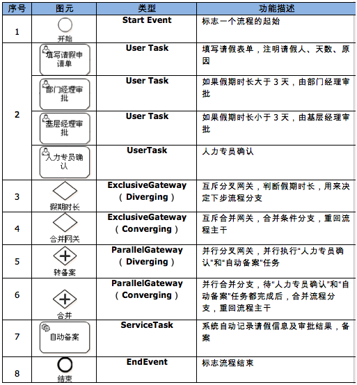

### 概念

#### 工作流
>工作流（workflow）就是工作流程的计算模型，即将工作流程中的工作如何前后组织在一起的逻辑和规则在计算机中以恰当的模型进行表示并对其实施计算。它主要解决的是“使在多个参与者之间按照某种预定义的规则传递文档、信息或任务的过程自动进行，从而实现某个预期的业务目标，或者促使此目标的实现”

#### BPMN
>BPMN是一套流程建模的标准，主要目标是被所有业务用户容易理解的符号，支持从创建流程轮廓的业务分析到这些流程的最终实现，知道最终用户的管理监控。

#### activiti
>Activiti是一个开源的工作流引擎，它实现了BPMN 2.0规范，可以发布设计好的流程定义，并通过api进行流程调度。

工作流的开发流程：
1. 创建流程图
2. 上传流程图（利用processEnginer保存流程图）
3. 部署流程图（RepositorySerivece加载流程图，然后部署流程图）
4. 启动流程：ProcessInstance 流程实例，Runtime，通过运行时服务(RuntimeSerivice得到流程实例)
5. 处理流程任务： 任务Task，通过任务服务(TaskSerivice)可以去检索待处理的任务(Handle task)

activiti架构与组件：  

- Activiti Modeler：模型设计器。用于业务人员把需求转换为规范流程定义
- Activiti Designer：功能和Activiti Modeler类似。适用于开发人员
- Activiti Explore：可以用来管理仓库，用户，组，启动流程，任务办理等。 
- Activiti REST：运行客户端以JSON的方式与引擎的REST API 交互，通用的协议具有跨平台，跨语言的特性。

##### Activiti相关的操作类：
- 流程引擎配置ProcessE    ngineConfiguration：创建流程
- 流程引擎ProcessEngine：拿到流程服务，比如仓库服务，运行时服务，任务服务
- 流程实例ProcessInstance
- 仓库服务RepositoryService
- 运行服务RuntimeSerivice
- 任务服务TaskService
- 历史服务HistoryService
- 管理和查询用户服务IdentifyService
- 读取流程表单相关数据FormService
- 引擎管理服务ManagementService

##### Activiti数据表

数据库表命名都是由ACT_开头。
- ACT_RE_*:’RE’表示repository。带有此前缀的表包含的是静态信息，如：流程定义、流程资源。
- ACT_RU_*:’RU’表示runtime。这是运行时的表，存储着流程变量、用户任务、职责等运行时的数据。
- ACT_ID_*:’ID’表示identity。这些表包含标识的信息，如用户、用户组等等。
- ACT_HI_*:’HI’表示history。这些表包含着历史的相关数据，如结束的流程实例、变量、任务等等。
- ACT_GE_*:普通数据，各种情况都使用的数据。

#### BPMN元素

